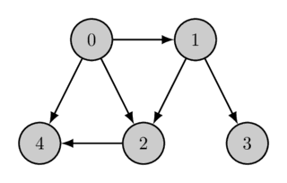

---
tags:
  - Translated
e_maxx_link: topological_sort
---

# Topological Sorting

You are given a directed graph with $n$ vertices and $m$ edges.
You have to find an **order of the vertices**, so that every edge leads from the vertex with a smaller index to a vertex with a larger one.

In other words, you want to find a permutation of the vertices (**topological order**) which corresponds to the order defined by all edges of the graph.

Here is one given graph together with its topological order:

<center>


</center>

Topological order can be **non-unique** (for example, if there exist three vertices $a$, $b$, $c$ for which there exist paths from $a$ to $b$ and from $a$ to $c$ but not paths from $b$ to $c$ or from $c$ to $b$).
The example graph also has multiple topological orders, a second topological order is the following:
<center>

</center>

A Topological order may **not exist** at all.
It only exists, if the directed graph contains no cycles.
Otherwise because there is a contradiction: if there is a cycle containing the vertices $a$ and $b$, then $a$ needs to have a smaller index than $b$ (since you can reach $b$ from $a$) and also a bigger one (as you can reach $a$ from $b$).
The algorithm described in this article also shows by construction, that every acyclic directed graph contains at least one topological order.

A common problem in which topological sorting occurs is the following. There are $n$ variables with unknown values. For some variables we know that one of them is less than the other. You have to check whether these constraints are contradictory, and if not, output the variables in ascending order (if several answers are possible, output any of them). It is easy to notice that this is exactly the problem of finding topological order of a graph with $n$ vertices.

## The Algorithm

To solve this problem we will use [depth-first search](depth-first-search.md).

Let's assume that the graph is acyclic. What does the depth-first search do?

When starting from some vertex $v$, DFS tries to traverse along all edges outgoing from $v$.
It stops at the edges for which the ends have been already been visited previously, and traverses along the rest of the edges and continues recursively at their ends.

Thus, by the time of the function call $\text{dfs}(v)$ has finished, all vertices that are reachable from $v$ have been either directly (via one edge) or indirectly visited by the search.

Let's append the vertex $v$ to a list, when we finish $\text{dfs}(v)$. Since all reachable vertices have already been visited, they will already be in the list when we append $v$.
Let's do this for every vertex in the graph, with one or multiple depth-first search runs.
For every directed edge $v \rightarrow u$ in the graph, $u$ will appear earlier in this list than $v$, because $u$ is reachable from $v$.
So if we just label the vertices in this list with $n-1, n-2, \dots, 1, 0$, we have found a topological order of the graph.
In other words, the list represents the reversed topological order.

These explanations can also be presented in terms of exit times of the DFS algorithm.
The exit time for vertex $v$ is the time at which the function call $\text{dfs}(v)$ finished (the times can be numbered from $0$ to $n-1$).
It is easy to understand that exit time of any vertex $v$ is always greater than the exit time of any vertex reachable from it (since they were visited either before the call $\text{dfs}(v)$ or during it). Thus, the desired topological ordering are the vertices in descending order of their exit times.

## Implementation

Here is an implementation which assumes that the graph is acyclic, i.e. the desired topological ordering exists. If necessary, you can easily check that the graph is acyclic, as described in the article on [depth-first search](depth-first-search.md).

```cpp
int n; // number of vertices
vector<vector<int>> adj; // adjacency list of graph
vector<bool> visited;
vector<int> ans;

void dfs(int v) {
    visited[v] = true;
    for (int u : adj[v]) {
        if (!visited[u])
            dfs(u);
    }
    ans.push_back(v);
}
 
void topological_sort() {
    visited.assign(n, false);
    ans.clear();
    for (int i = 0; i < n; ++i) {
        if (!visited[i])
            dfs(i);
    }
    reverse(ans.begin(), ans.end());
}
```

The main function of the solution is `topological_sort`, which initializes DFS variables, launches DFS and receives the answer in the vector `ans`.

## Practice Problems

- [SPOJ TOPOSORT - Topological Sorting [difficulty: easy]](http://www.spoj.com/problems/TOPOSORT/)
- [UVA 10305 - Ordering Tasks [difficulty: easy]](https://onlinejudge.org/index.php?option=onlinejudge&page=show_problem&problem=1246)
- [UVA 124 - Following Orders [difficulty: easy]](https://onlinejudge.org/index.php?option=onlinejudge&page=show_problem&problem=60)
- [UVA 200 - Rare Order [difficulty: easy]](https://onlinejudge.org/index.php?option=onlinejudge&page=show_problem&problem=136)
- [Codeforces 510C - Fox and Names [difficulty: easy]](http://codeforces.com/problemset/problem/510/C)
- [SPOJ RPLA - Answer the boss!](https://www.spoj.com/problems/RPLA/)
- [CSES - Course Schedule](https://cses.fi/problemset/task/1679)
- [CSES - Longest Flight Route](https://cses.fi/problemset/task/1680)
- [CSES - Game Routes](https://cses.fi/problemset/task/1681)
